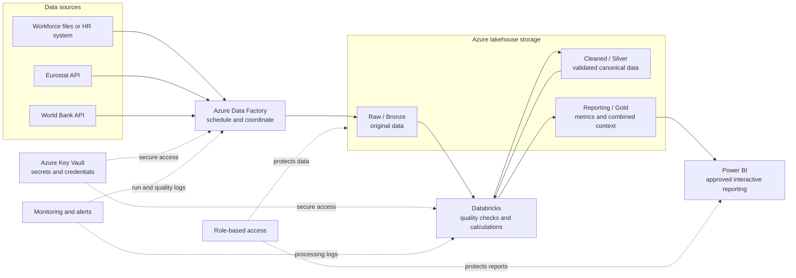

# Architecture boundaries

Status: local vertical slice and production mapping documented

## Local vertical slice

```text
CLI orchestration
    |
    +-- provider adapters ------> Eurostat / World Bank / offline fixtures
    |
    +-- workforce adapter ------> supplied synthetic CSV files
    |
    +-- domain rules -----------> quality, retention, temporal alignment
    |
    +-- pipeline services ------> ingest, curate, analyse
    |
    +-- DuckDB storage ---------> source-shaped, canonical, analytical tables
    |
    +-- Streamlit dashboard ----> reads analytical outputs only
```

## Boundary responsibilities

### Adapters

Translate external formats into source-shaped records. They know HTTP, CSV, provider codes, timeouts, and raw-response metadata. They do not decide retention formulas.

This is comparable to an infrastructure project or HTTP client in a .NET solution.

### Domain

Contains business meaning: eligibility, anniversaries, senior scope, metric formulas, quality decisions, and temporal rules. It should not know Streamlit, HTTP URLs, or DuckDB connection details.

This is comparable to a .NET domain or core project.

### Pipeline

Coordinates steps in the required order and handles partial outcomes. It calls adapters, domain functions, and storage ports but should contain little calculation logic itself.

This is comparable to an application-service layer.

### Storage

Owns DuckDB schema creation, explicit overwrite/upsert behaviour, queries, and load metadata. It does not silently change business values.

This is comparable to a repository or persistence project.

### Dashboard

Reads prepared analytical results and displays filters, charts, quality information, caveats, and error states. Metric calculations do not belong in the UI.

This follows the same principle as keeping business logic out of Angular components.

## Configuration

Checked-in TOML defines stable, non-secret contracts such as country mappings, indicator codes, and quality actions. Secrets must come from environment variables or an approved secret store; no selected provider currently requires an API key.

## Production architecture view

This is a blueprint for how a larger company could operate the same product. It is not infrastructure required to run this assessment, and the project does not provision Azure, Databricks, or Power BI resources.



### What each production component does

#### Azure Data Factory: the coordinator

Azure Data Factory, or ADF, starts the workflow on an approved schedule and coordinates the steps in order. It can retry temporary failures and notify the responsible team. It corresponds to the local `python -m asteria_retention run` command; it coordinates work rather than defining retention formulas.

#### Lakehouse: the organised storage area

The lakehouse separates data by preparation level:

- Raw or Bronze preserves the original workforce delivery and API responses.
- Cleaned or Silver contains validated, normalised, source-grain data plus visible quality outcomes.
- Reporting or Gold contains retention metrics, aligned economic context, associations, and dashboard-ready results.

Bronze, Silver, and Gold are labels for data preparation levels, not three additional products.

#### Databricks: scalable processing

Databricks runs the same types of Python transformations as the local domain and pipeline modules when company-scale volume or parallel processing requires more compute. Business rules remain version-controlled and tested; they are not moved into the dashboard.

#### Power BI: reporting consumption

Power BI reads approved Gold data through a governed semantic model. It provides the production country, time, objective, and business-unit experience. Like the local Streamlit app, it displays prepared results and does not own data-cleaning or retention rules.

## Local-to-production mapping

| Local assessment component | Production equivalent | Meaning |
| --- | --- | --- |
| `asteria-retention run` | Azure Data Factory pipeline | Runs scheduled steps in the correct order |
| `data/raw` | Raw/Bronze lakehouse tables or files | Preserves source evidence |
| `data/canonical` | Cleaned/Silver lakehouse tables | Holds validated source-grain data |
| Analytical CSVs and DuckDB tables | Reporting/Gold tables | Holds metrics and combined context |
| Python adapters | ADF or Databricks ingestion activities | Reads provider and workforce formats |
| Python domain modules | Tested Databricks Python jobs | Applies quality, metric, and alignment rules |
| DuckDB | Local stand-in for the governed serving layer | Makes analytical data queryable |
| Streamlit | Power BI | Presents filters, findings, and evidence |
| Checked-in TOML | Deployed environment configuration | Stores non-secret indicator and quality contracts |

## Production operating concerns

### Secrets

Credentials for a future HR source or protected storage belong in Azure Key Vault. ADF and Databricks use managed identities—service access badges—instead of passwords committed to source control. The currently selected public APIs require no key.

### Scheduling and failure handling

ADF runs the workflow at the agreed workforce-reporting cadence. Temporary API failures receive bounded retries. A failed quality gate stops publication of new Gold data, while the previous approved reporting version remains available.

### Observability

Each run records its start, completion, row counts, source version, quality exclusions, and failed stage. ADF and Databricks logs feed central monitoring and alerts. This is the production counterpart of local JSON summaries, reason codes, and `core_run_summary.json`.

### Storage and recovery

Raw responses are immutable and retained according to policy so a run can be replayed. Cleaned and reporting tables are versioned or transactionally replaced. A failed run does not silently publish a partial reporting layer.

### Access control

Role-based access grants only the permissions needed for each job. Data engineers can operate pipelines, approved HR analysts can access governed workforce detail, report users receive approved aggregates, and service identities receive only their required storage paths. Production workforce data is encrypted in transit and at rest.

### Development, test, and production promotion

Development, test, and production use separate workspaces, storage, identities, and configuration. Code changes move through Git review, automated tests, deployment to test, human validation, and controlled production release. Secrets and data are never copied from production into source control.

## Deliberate production-design limits

- This assessment does not deploy paid cloud infrastructure.
- It does not prescribe a specific organisation's retention schedule or access groups without stakeholder input.
- Databricks is a scale mapping, not a claim that the supplied data needs distributed processing.
- Power BI is the requested production consumption mapping; Streamlit remains the runnable local experience.
