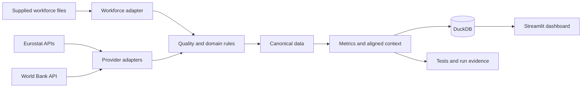
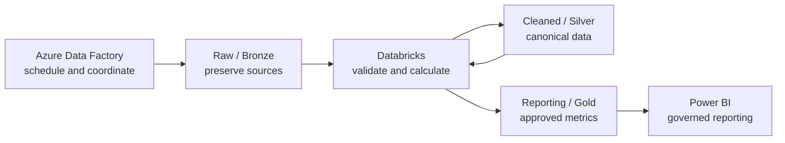

# Asteria retention and external signals

## A small, testable workforce data product

**Software Emphasis track**  
Workforce objectives: 2021–2025  
External context: unemployment, job vacancies, and consumer-price inflation

Fictional company and synthetic workforce data.

> Presentation plan: 15 minutes, followed by 15 minutes of technical and analytical questions.

---

# 1. Problem refinement and scope

**Assessment allocation: 3 minutes**

The business question is not simply, “Does the economy cause employees to leave?” The supplied data cannot prove that.

This project answers three narrower questions:

1. Are the three workforce objectives being met?
2. Where do country, period, and business-unit results need attention?
3. Do selected public economic indicators show a useful descriptive relationship with those results?

## Deliberate scope

- Quarterly country-level reporting, with business-unit detail shown separately.
- Full 2021–2025 workforce objective period.
- 2020 unemployment and vacancy data used only to complete early-2021 trailing windows.
- Consumer-price inflation kept at its native annual frequency.
- Association is reported, but causation is never claimed.

---

# The metric contract came before the code

| Objective | Approved calculation | Target |
| --- | --- | ---: |
| New-hire retention | Retained through the calendar-month six-month anniversary | At least 86% |
| Senior-hire retention | Retained through the calendar-month twelve-month anniversary | At least 90% |
| Regretted turnover | Trailing-twelve-month regretted exits divided by the average of 12 month-end headcounts | At most 7.5% |

Key decisions:

- Termination on the anniversary still counts as retained through that anniversary.
- `Senior Leader` and normalised `Sr Mgmt` are senior; `Manager` is not.
- Invalid records are excluded with visible reason codes.
- Missing classifications remain unknown and are never guessed.
- Business unit is treated as constant because no transfer history was supplied.

This contract makes the numbers explainable and prevents business rules from being hidden inside charts.

---

# 2. Architecture, lineage, and reliability

**Assessment allocation: 5 minutes**

- Adapters translate source formats.
- Domain code owns metric meaning and quality decisions.
- Pipeline services coordinate the steps.
- DuckDB stores queryable evidence locally.
- Streamlit reads prepared results; it does not calculate the business rules.

This resembles a familiar .NET separation: infrastructure, domain, application services, persistence, and UI.

---

# Source fitness and traceable lineage

| Source | Use | Important boundary |
| --- | --- | --- |
| Supplied lifecycle CSV | Workforce cohorts, headcount, exits | Synthetic assessment data; no job-transfer history |
| Supplied objectives CSV | Metric definitions and targets | Implemented through the approved metric contract |
| Eurostat unemployment | Same-quarter hire context and trailing turnover context | Current downloaded vintage can include later revisions |
| Eurostat job vacancies, `jvs_q_nace2`, B–S | Labour-demand context | Quarterly, some values provisional, publication delayed |
| World Bank consumer-price inflation | Annual price-pressure context | Kept annual; not copied into quarters |

Lineage is visible through preserved source metadata, canonical files, quality evidence, analytical outputs, DuckDB load records, and the final dashboard.

---

# Reliability is observable, replayable, and tested

## Data-quality evidence

- 2,381 analytical workforce rows.
- 71 quality-evidence rows.
- 19 excluded records with explicit reasons.
- 7 exact duplicate rows reduced to one copy each.
- Missing-country and missing-hire-date rows are retained as evidence but excluded only from metrics they cannot support.

## Run safety

- One online command refreshes sources and rebuilds the product.
- Offline mode validates cached data or replays small reviewed provider responses.
- Fixture checksums detect changed replay evidence.
- DuckDB is rebuilt last, so an earlier failure does not replace the previous working database.
- Stage failures are named and written to a run summary.
- 77 automated tests check formulas, quality rules, API failure handling, alignment, storage, orchestration, and dashboard recovery.

---

# Local solution, clear production path

The production design also adds Key Vault, managed identities, monitoring, role-based access, separate environments, and controlled releases.

This is a mapping, not an unnecessary cloud deployment for a small assessment dataset.

---

# 3. Dashboard and key findings

**Assessment allocation: 4 minutes**

## Live demonstration path

1. Start with the three objective-level results.
2. Filter by objective, country, year, and business unit.
3. Show the workforce trend and target line.
4. Open economic context and explain the matching time window.
5. Finish on Trust and methodology: quality, freshness, sources, and limitations.

The dashboard recalculates rates from numerators and denominators. It does not average percentages, which could produce a misleading total.

Economic relationships remain country-level even when business-unit detail is explored, because the external indicators are national rather than business-unit measures.

---

# Three objectives, one clear concern

| Objective | Result | Interpretation |
| --- | ---: | --- |
| Six-month new-hire retention | **87.2%** vs 86% | Generally met; 2023 and Sales were below target |
| Twelve-month senior-hire retention | **78.6%** vs 90% | Clearest concern; small cohorts require caution |
| Regretted turnover | **3.2%–5.0% annually** vs maximum 7.5% | Met annually; rose to 5.0% in 2025 |

Additional context:

- Senior retention was below 90% in every country and business unit across the full measurable period.
- All 90 senior country-quarter comparison rows have a small-sample warning.
- There is no measurable 2025 twelve-month senior cohort yet; incomplete anniversaries are not counted as failures.
- 108 of 120 country-quarter turnover observations met target; 12 exceeded it.

---

# Economic context produced a useful non-finding

Most of the nine Spearman rank-correlation scores are close to zero.

- The score furthest from zero is turnover versus trailing job vacancies: **-0.263**.
- Inflation versus senior retention is **-0.003**.
- Inflation versus turnover is **-0.002**.

The honest conclusion is that these indicators do not provide a clear overall explanation for the workforce results.

This does not prove that the economy has no effect. It means this dataset and method do not show a strong, consistent relationship. Repeated countries, small senior cohorts, national indicators, revisions, and the unusual 2020 context all limit interpretation.

---

# 4. Tradeoffs, AI usage, and next steps

**Assessment allocation: 3 minutes**

## Deliberate tradeoffs

- DuckDB instead of a database server: enough SQL and analytical capability with almost no operating burden.
- Streamlit instead of Angular: faster evidence delivery; production consumption maps to Power BI.
- Spearman association instead of prediction: understandable and proportionate to the data.
- Warning on small groups instead of suppression: preserves evidence while making uncertainty visible.
- Current public-data vintage instead of pretending to reconstruct what was known historically.

## Accountable AI operating loop

1. I set and approved the metric, quality, source, and interpretation contracts.
2. The agent drafted code, tests, documentation, and candidate findings in small increments.
3. I questioned unclear choices and approved each material change.
4. I corrected the missing 2020 support-history requirement.
5. We verified outputs with tests, source metadata, reconciliations, and visual inspection.

---

# What I would do next

1. Review the senior-retention concern with HR partners using larger, privacy-safe groups.
2. Add job family, location, compensation, and transfer history if governed data becomes available.
3. Agree publication schedules, access roles, and alert thresholds before production use.
4. Promote the tested rules into the documented ADF, lakehouse, Databricks, and Power BI design only when scale and governance justify it.

## Closing message

The solution is intentionally small, reproducible, and explainable. It answers the three objectives, preserves evidence, exposes uncertainty, and avoids claiming that weak associations are causes.

---

# Questions

Useful places to challenge the work:

- Metric definitions and edge cases
- Data-quality treatments
- Source selection and time alignment
- Small-sample and correlation limits
- Failure handling and offline replay
- Local-to-production architecture
- Candidate decisions and AI verification
